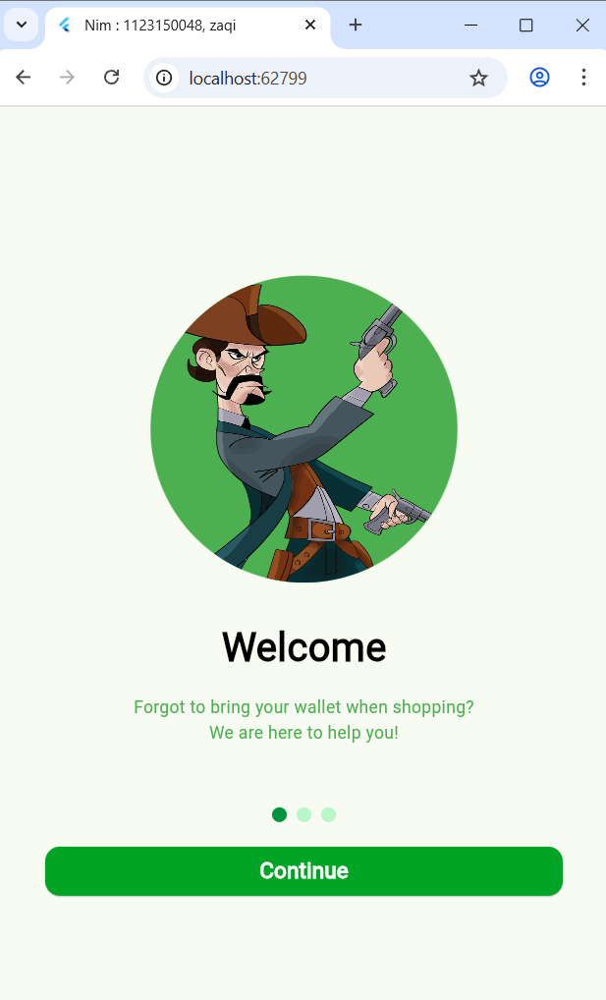
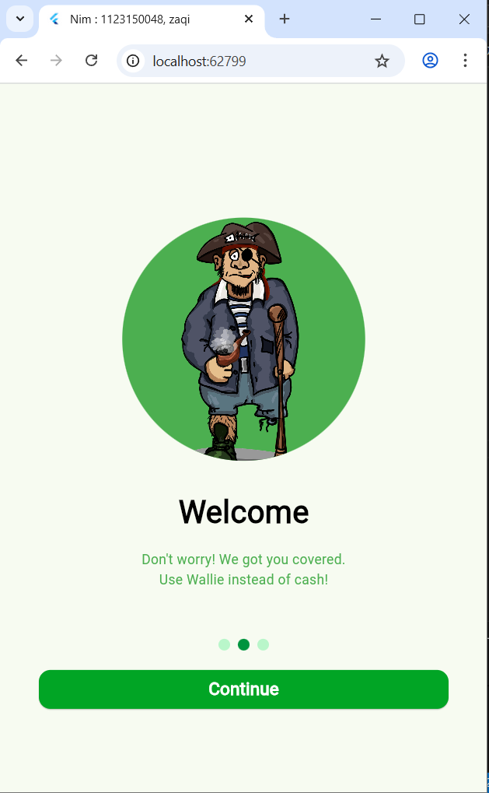
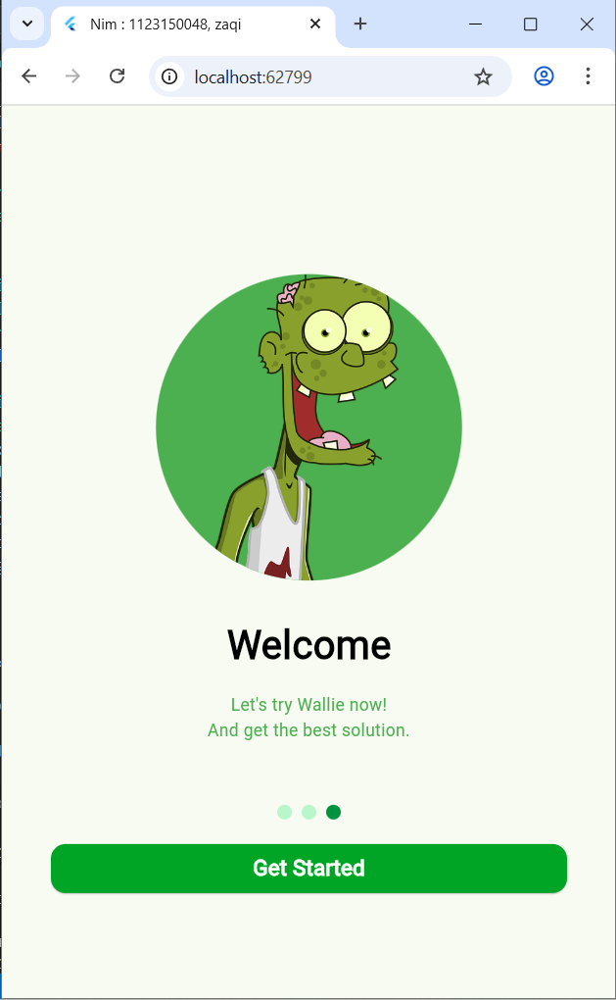

#  UTS MOBILE APP

Aplikasi Flutter dengan fitur Splash Screen dan Login, dibuat untuk memenuhi tugas UTS Mata Kuliah **Pemrograman Mobile**.

* **Nama:** Zaqi Maulana  
* **NIM:** 1123150048  

---

## Hasil Screenshot

  
  
  
  

---

##  Cara Menjalankan Project

1. Buka project di **Android Studio** atau **VS Code**.  
2. Pastikan perangkat (emulator atau HP) sudah terhubung.  
3. Jalankan perintah berikut di terminal:
   ```bash
   flutter run / f5
